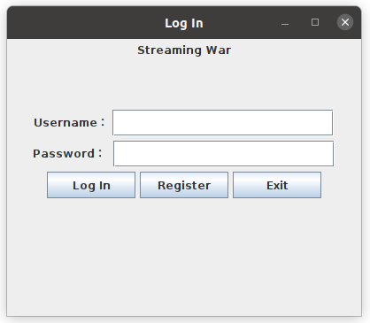
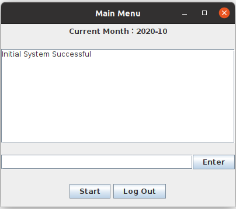

# Team Project - Streaming Provider

This is a software design course project from the course of CS6310 - Software Architecture & Design in Georgia Institute of Technology in Spring 2021 semester

This is a single-user **Streaming Provider Project** system with the purpose of simulating the interactions among various demographic groups, streaming services and studios.

This project is developed in Java, the graphic interface was designed and developed in Swing.

**Author**:

- Renyu Zhang
- Zhang Liang
- Chen Yuan
## Running Environment

OS: Windows, Mac OS, Ubuntu

JAVA: JAVA JDK 11

To start the program: java -jar StreamingProvider.jar

## Snapshot
Below are two windows a user will be able to see while using this system:

## 1. Login Menu Instruction

Only the registered user can access the system and execute command lines

Please follow the steps to login:

1. Type in Username (sample account: "jimmy")
2. Type in Password (sample account: "6310ta")
3. Click "Login" button if the username & password have been registered 
4. Click "Register" button if the user needs to register the username and password 
5. Click "Exit" to exit the system and close the window

## 2. Main Menu Instruction

After the account checking process, the system will automatically jump to the Main Menu window. The user could type command lines to run the system.

**Supported commands:**

- create_demo,< short name >,< long name >,< number of accounts >;
- create_studio,< short name >,< long name >;
- create_event,< type >,< name >,< year produced >,< duration >,< studio >,< license fee >
- create_stream,< short name >,< long name >,< subscription price >
- offer_movie,< streaming service >,< movie name >,< year produced >
- offer_ppv,< streaming service >,< pay-per-view name >,< year produced >,< viewing price >
- watch_event,< demographic group >,< percentage >,< streaming service >,< event name >,< year produced >
- display_demo,< short name >
- display_stream,< short name >
- display_studio,< short name >
- display_events
- display_offers
- display_time
- next_month
- update_demo,< short name >,< number of accounts >;
- update_event,< name >,< year produced >,< license fee >;
- update_stream,< short name >,< subscription price >;
- retract_movie,< streaming service >,< movie name >,< movie year >;
- clear_all; [Clean all the record in system except user information, restore time to 2020-10]
- refresh; [Refresh and clean the screen]
- test busy; [Start an infinite looping program to test system's performance in busy]
- test confirmation; [Start an  program to test system's performance in repeatly sending command into system but system is in busy, until time out]

**Instruction:**

1. Type a command line in the text field
2. Click "Enter" button to execute the command 
3. Click "Start" button to automatically run the pre-typed commands 
4. Click the "X" button at the top to exit 

## 3. Start Button

Start button can automatically execute some prepaird command into system to generate some records for test. Followed is the preparid command:

**studio(4)**

* create_studio,warner,Warner Brothers
* create_studio,columbia,Columbia Pictures
* create_studio,20cent,20th Century Fox
* create_studio,espn,Entertainment Sports Network

**Event(9)**

* create_event,movie,Batman Begins,2005,140,warner,1000"
* create_event,movie,Tenet,2020,150,warner,4000"
* create_event,movie,Wonder Woman,2017,114,warner,2000"
* create_event,movie,Hollow Man,2000,112,columbia,1000"
* create_event,movie,The Grudge,2004,91,columbia,1000"
* create_event,movie,The New Mutants,2020,94,20cent,3000"
* create_event,ppv,Justice League Live,2020,180,warner,12000"
* create_event,ppv,World Blitz Championship,2020,180,espn,3000"
* create_event,ppv,EuroCup Football,2020,120,espn,5000"

**Streaming Service(3)**

* create_stream,net,Netflix,12"
* create_stream,apv,Amazon Prime Video,15"
* create_stream,hulu,Hulu Plus,11"

**Demographic Group(3)**

* create_demo,age_40_50,Viewers between 40 and 50,800"
* create_demo,age_20_heroes,Viewers of Marvel/DC under 20,10000"
* create_demo,sci_fi,Viewers of Science Fiction,2000"

## 4. Additional Test Cases

Below are some suggested commands to test our system:

* display_studio,warner
* create_studio,warner,Warner Brothers
* display_demo,age_40_50
* update_demo,age_40_50,Viewers between 40 and 50,900
* display_demo,age_40_50
* display_events
* update_event,Batman Begins,2005,140,800
* display_events
* offer_movie,net,Hollow Man,2000
* offer_movie,net,Tenet,2020
* offer_movie,net,The Grudge,2004
* display_offers
* retract_movie,net,Tenet,2020
* display_offers
* refresh
* clear_all
